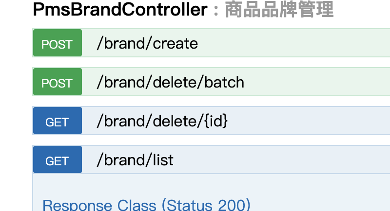
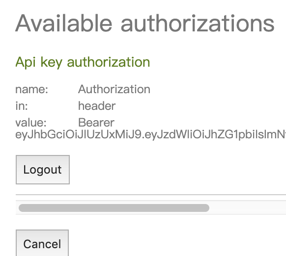
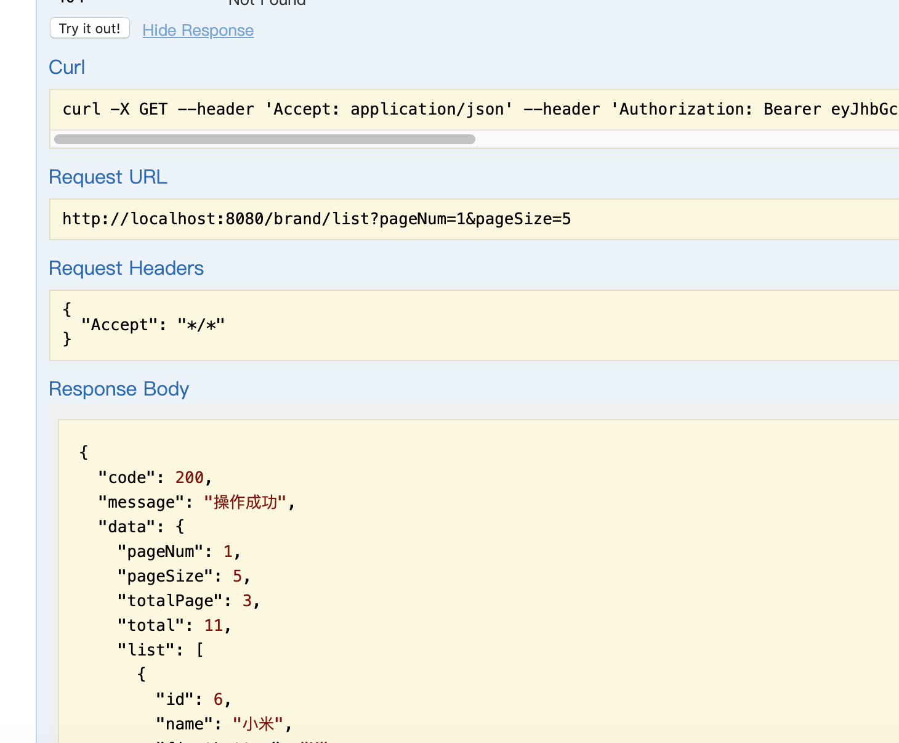

# 用mall商城项目进行接口实战
## [安装配置mall项目](install-env.md)
下面我们准备用github开源的mall项目进行后面部分的实战操作。大家需要跟着下载配置，安装环境。
## 尝试品牌接口的测试
这回有了token，我们就可以开始接口测试了。
### 品牌列表接口

这是swagger里面的一个品牌列表接口，我们可以在swagger上try一下。
### 填写token值
注意需要将token写入到Authorization中。如下图

### try it out

是不是拿到结果了。恭喜你，一个列表接口已经做了接口测试了。
