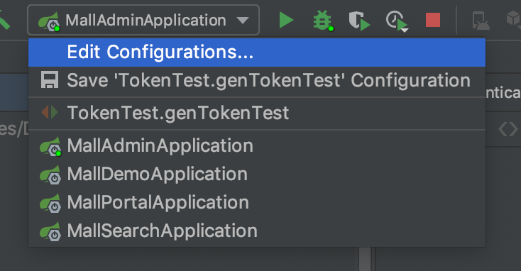

# mall项目
mall是一个开源的商城项目，基本上功能是跟我们在市面上看到的商城项目大同小异的。所以，拿这个项目做实战是非常合适的。同时，这个项目对于新手来说，也是很庞大的。需要花一点时间去熟悉它。
## github地址
地址：https://github.com/macrozheng/mall
把代码下载到本地之后，你需要按照要求[安装好idea和mysql](http://www.macrozheng.com/#/deploy/mall_deploy_windows)。我们后面先用mall-admin这个模块进行模拟，其他的暂时不涉及。
## 如何启动

可以看到用idea打开之后会自动配置好MailAdminApplication，我们启动它即可。
## 访问地址
访问地址就是http://localhost:8080。因为是个后端项目，所以不会有页面，我们直接访问http://localhost:8080/swagger-ui.html即可。
## 拿到admin的token
这个需要花费点时间了。我们需要在mall-admin项目里创建一个Test类，这样写：
```java
@RunWith(SpringRunner.class)
@SpringBootTest
public class TokenTest {
    @Resource
    private JwtTokenUtil tokenUtil;
    @Resource
    private UmsAdminService adminService;

    @Test
    public void genTokenTest() {
        UmsAdmin umsAdmin = adminService.getAdminByUsername("admin");
        UserDetails admin = new AdminUserDetails(umsAdmin,
                    adminService.getResourceList(umsAdmin.getId()));

        String token = tokenUtil.generateToken(admin);
        System.out.println("填写Authorization的值：Bearer " + token);

        System.out.println("此token的用户为：" + tokenUtil.getUserNameFromToken(token));
    }
}
```
运行这个genTokenTest，你就可以拿到Authorization对应的token值了。
## 小结
到这里，我们的mall-admin项目的环境就安装到这了。