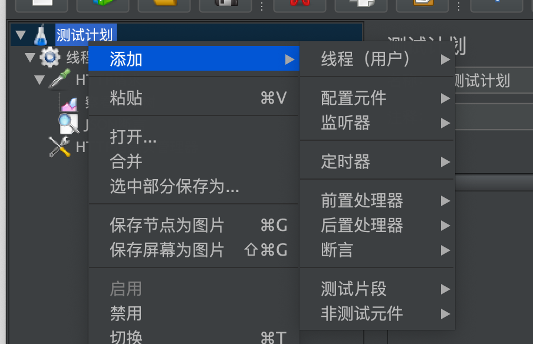
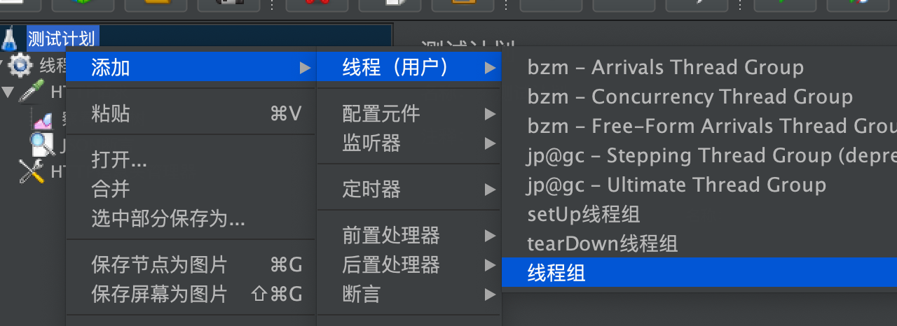
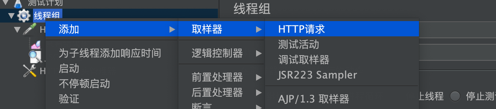
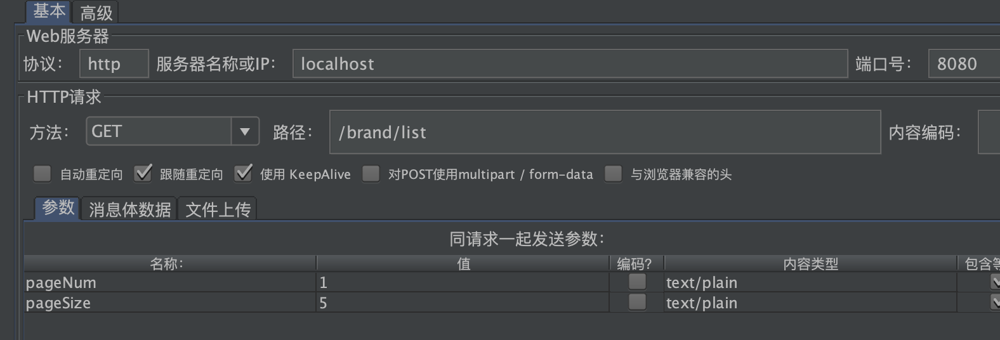
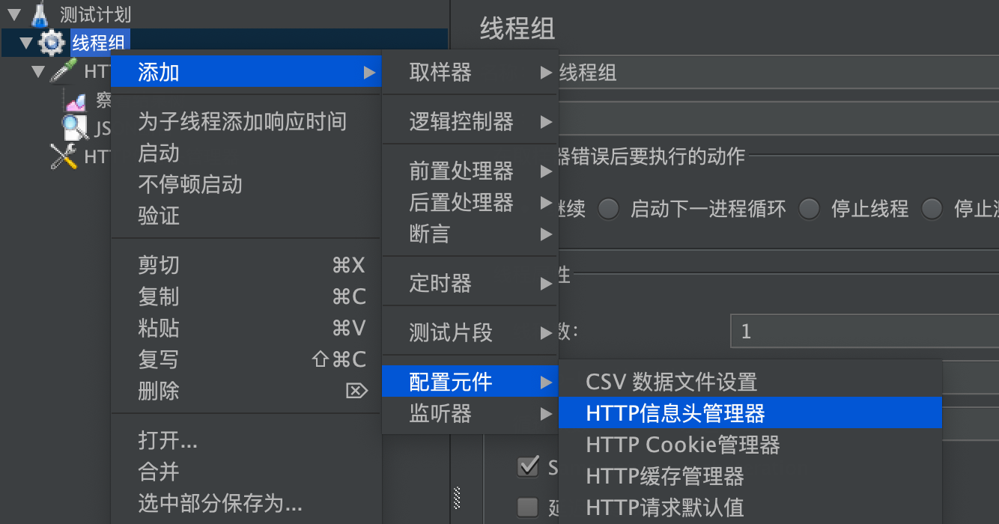
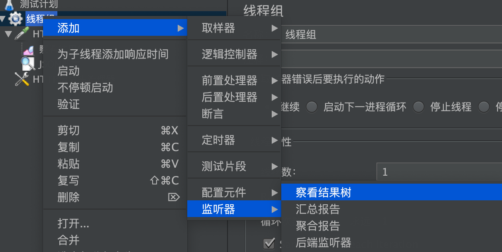
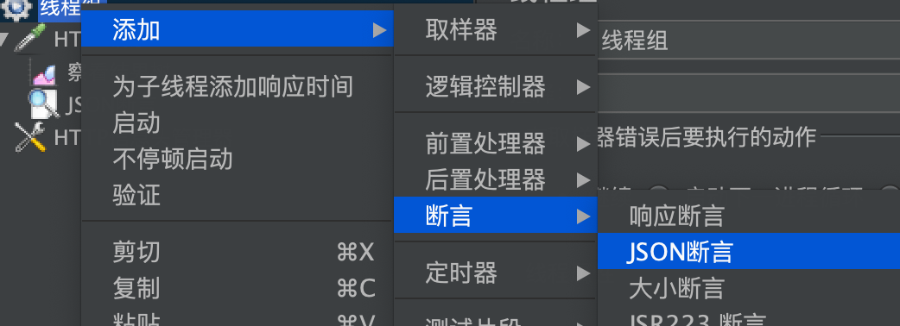
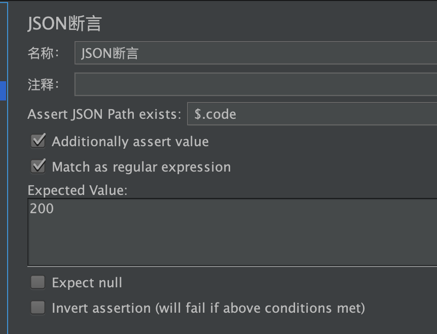

# jmeter接口测试案例
## jmeter工具介绍

说到jmeter，使用最多的就是截图的功能。涉及到：发送接口请求，接口响应断言，报告采集的监听器，设计定时器满足性能测试需求。
这里就不多做介绍了，后面我们会跟着案例，深入去熟悉每个元件的作用和使用。
## jmeter进行品牌列表的接口测试流程
1. 创建线程组

在测试计划上创建一个线程组。线程组的作用就是模拟多少的用户访问，也就是多少并发。
2. 创建HTTP请求的取样器

在线程组下面添加HTTP请求的取样器，作用是做HTTP请求。
咱们还是用品牌列表的GET接口做例子。

填写上相应的请求信息。我们还差一个header。
3. 创建HTTP信息头

Authorization的头信息需要用配置元件中的HTTP信息头管理器进行设置。我们把token值放进去。
4. 察看结果树

有了请求，我们需要观察请求响应情况，这就用到了监听器中的察看结果树了。它会列出每次请求和响应的结果。
5. 断言
有了接口，做测试当然少不了断言了。添加一个JSON断言。

里面可以设置好断言的预期结果。这里我们就检查下返回的code是不是200。当然在提取json时，涉及到一个语法问题。看着是不是像postman的取值模式啊？

6. 运行
运行之后我们看下结果吧。在结果树就可以看到了。是不是跟postman的步骤上差不多类似呢。
## 小结
今天主要介绍了用jmeter怎么测试品牌列表的接口。其实跟postman使用方式上还是有些相似的。希望大家做下这个实践。

