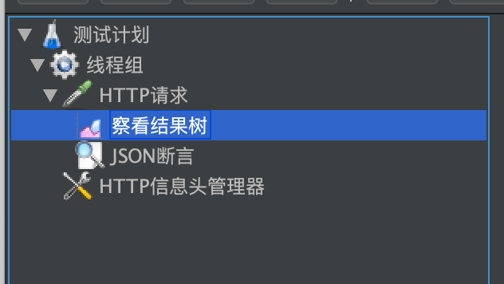
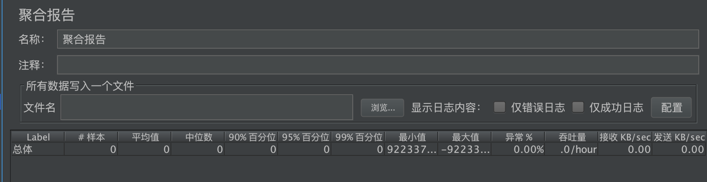

# 模拟100个用户进行品牌查询
## 品牌查询
在上一讲我们已经做了一个品牌查询的接口测试脚本。先来回顾下：

线程组：模拟用户数

HTTP请求：调用品牌查询接口

察看结果树：察看http请求和响应

json断言：断言响应

http信息头管理器：设置token值

## 添加聚合报告
对于结果，只是结果树对于性能测试来说，还不够。我们需要更加专业的报告。

聚合报告的作用是统计出这次测试接口响应情况和吞吐量（每秒完成的请求数）
## 测试目标和执行
本次的测试目标就是并发测试。当100个用户同时进行品牌查询时，看看系统会不会出错。
大家也可以试试1000个模拟用户是什么情况？
## 小结
这节课做了一个小并发的实验，就是模拟100个用户进行品牌查询的接口调用。看看系统的响应和吞吐量。最重要的是看看系统的数据有没有出错。

