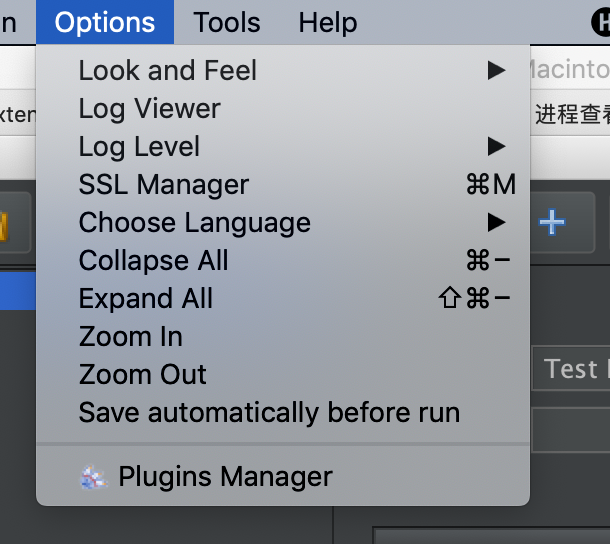
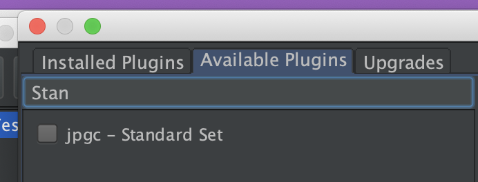
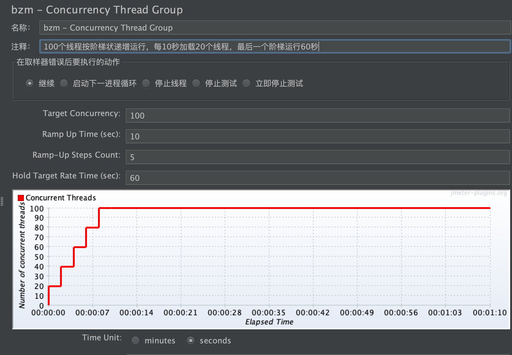
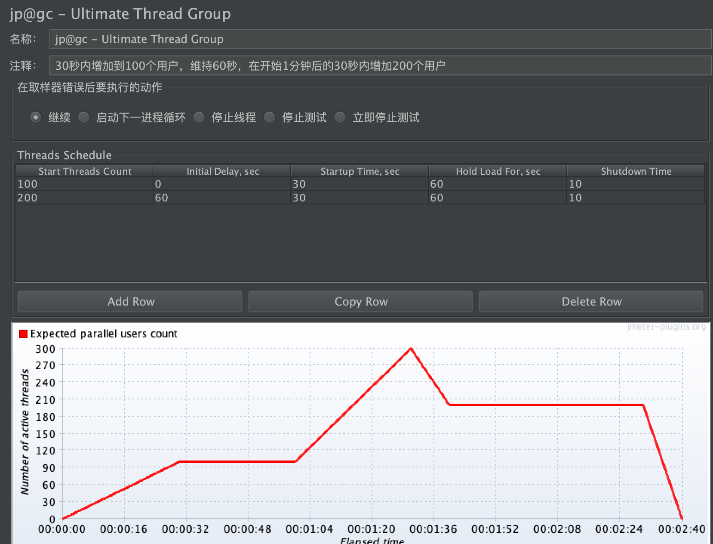
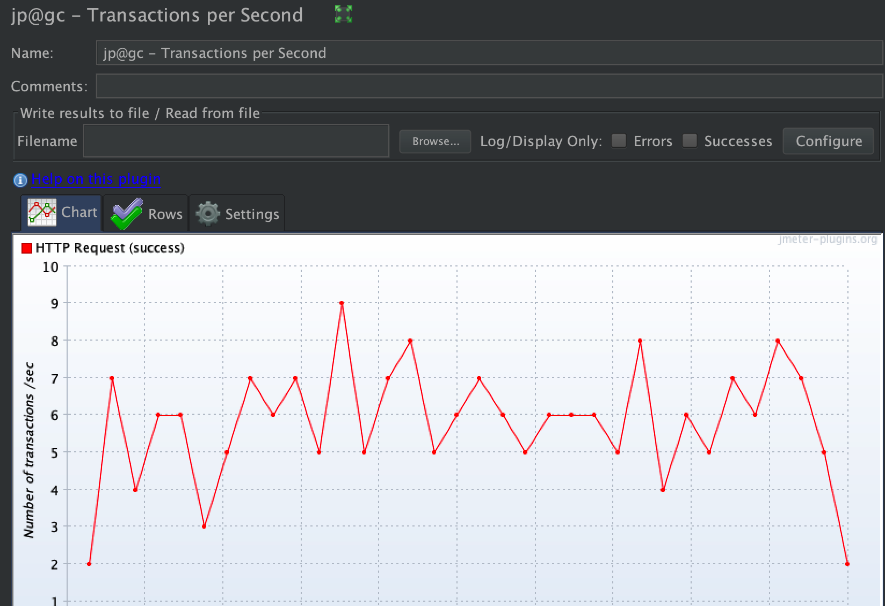

# 模拟真实场景下的品牌查询
## jmeter plugin安装
大家去[官网](https://jmeter-plugins.org/install/Install/)安装，然后放到lib/ext目录下，重启jmeter。
## plugins manager

在选项会多出一个Plugins Manager。
我们安装Standard Set，对线程组的扩展

## 模拟阶梯状用户并发场景

100个线程按阶梯状递增运行，每10秒加载20个线程，最后一个阶梯运行60秒
## 另一种并发方式，保持峰值访问

30秒内增加到100个用户，维持60秒，在开始1分钟后的30秒内增加200个用户
## 其他的监控

查看TPS的曲线图
## 小结
插件提供了更多方式的线程组和监控，其实都是针对现实中的场景做出的。所以，多想想现实的场景去设计接口测试。