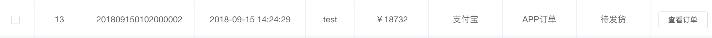
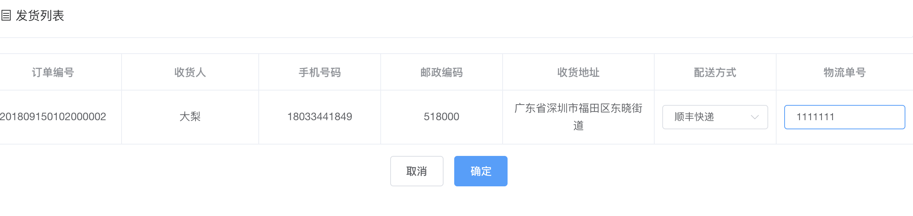
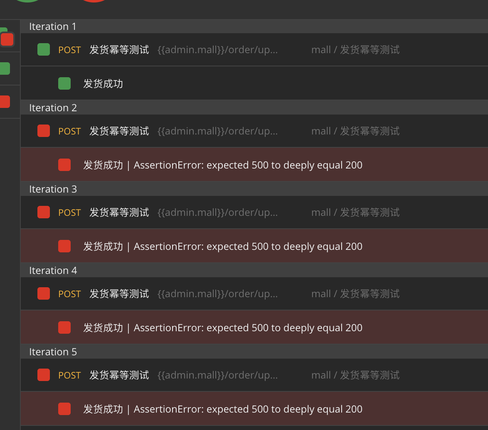

# 从发货接口说接口幂等性
## 先说下发货接口的功能

可以看到这是一个待发货的订单。熟悉电商流程的都知道，我们在买了东西之后，商家会把货交到快递手中，然后商家将快递单号告知系统。系统进行订单状态的变更。所以下面的操作就顺理成章：

发货的动作是对应着一个后端接口的。也就是咱们今天要说的接口：order/update/delivery。这是一个POST请求，传入的数据如下：
```json
[
    {
        "orderId": 13,
        "orderSn": "201809150102000002",
        "receiverName": "大梨",
        "receiverPhone": "18033441849",
        "receiverPostCode": "518000",
        "address": "广东省深圳市福田区东晓街道",
        "deliveryCompany": "顺丰快递",
        "deliverySn": null
    }
]
```
## 接口的幂等性
从上面的发货接口可以看出来，发货的本质上是对订单状态的更新，而这个更新是一次性的动作，不能每次调用都更新一次。所以幂等通俗的说就是多次调用系统的表现应该是一致的。所以网上很多的例子都是在说扣款。多次扫码只能扣费一次，而不能扣费多次。到这里其实也是一样的。
关于具体的技术文章大家可以参考下面的两篇：
[高并发下接口幂等性解决方案](https://www.cnblogs.com/linjiqin/p/9678022.html)
[再谈幂等机制](https://juejin.im/post/5b134000e51d4506b9429e4a)
## 幂等接口的测试
从上面的表述大家应该可以看出来了。要测试幂等也很容易，就是多调用几下，看看结果是否符合预期。
的确是这样，想到要进行幂等的测试方案，执行就很简单了。而验证也是简单的。
可以看到，我们用postman对接口运行4次，从第二次的结果看就返回500错误了。

## mall的乐观锁解决方案
为什么会返回500呢？mall项目是如何保证状态的幂等的。我们可以通过源码看到，update order的sql语句中多加了一个where条件：status = 1。就是说当且仅当状态是1-未发货才可以更新为2-已发货，如果已经是2-已发货，或者是其他状态，是不会查询到这条记录的。这样就保证了状态只改变了一次。
## 其他的幂等性校验场景
查询和删除（物理删除）是天然的幂等，而创建和更新操作需要考虑幂等性校验。
## 小结
通过对发货接口的幂等性校验的说明，让大家了解了什么是幂等，怎么设计幂等性场景，以及乐观锁的解决方案。