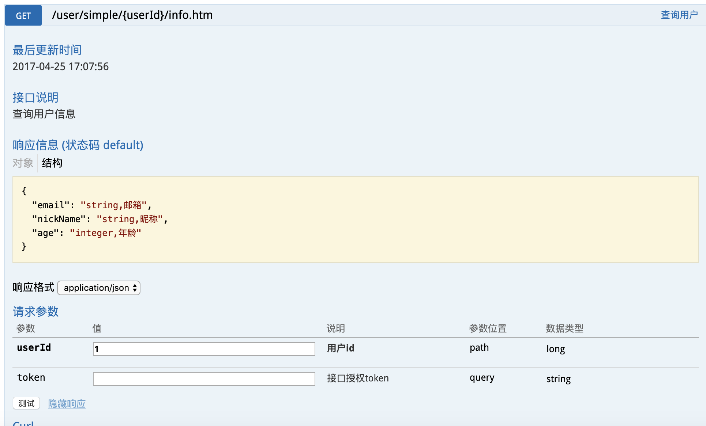
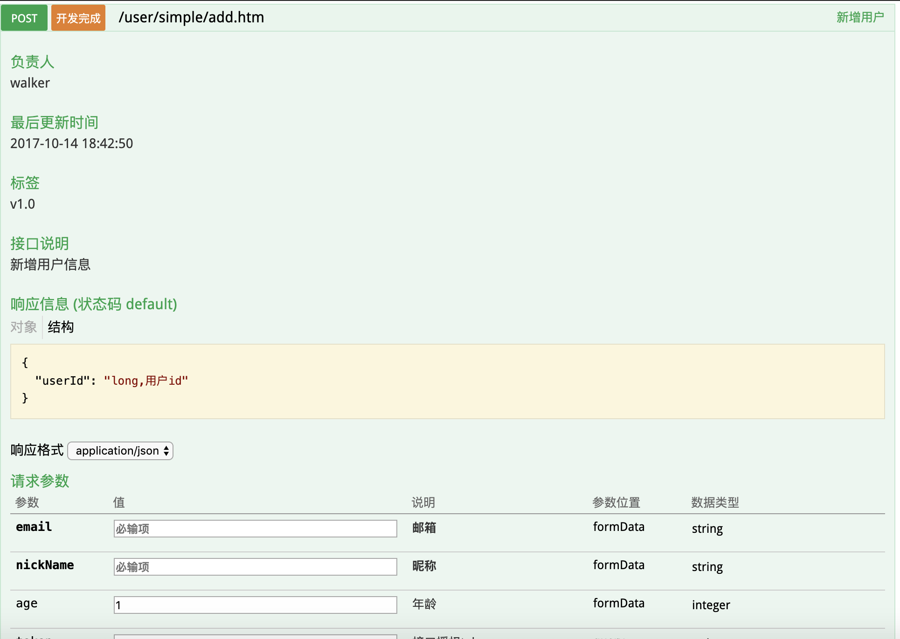
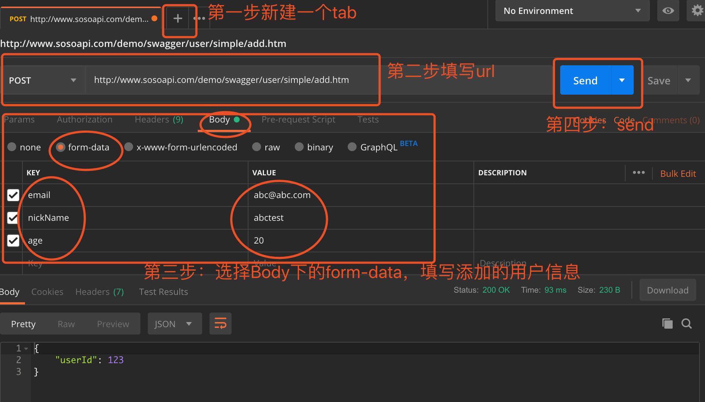

# POSTMAN的简单使用
# postman的基本使用
## 概述
我相信对于postman的介绍，网上一搜肯定很多很多。下面我就不打算跟大家普及postman了。只看应该怎么用postman进行接口测试。好了，下面咱们直接进入正文吧。
## 环境
postman之前是作为chrome插件形式存在的。后面变成了独立的应用需要下载安装。当然，对于接口测试来说，其实都一样的。我们可以到postman官网：https://www.getpostman.com/downloads/下载。
我当前使用的版本是7.2.2，最新版是7.11.0。
下载完成后，我们可以创建账户然后登陆。账户的意义是在postman的记录都会保留到账户中，当你用另一台机器登陆账户之后，记录就会随之同步到新的机器。
我们这次的API实验环境用sosoapi：http://www.sosoapi.com/。
大家可以打开看看在线demo。里面有api的描述。

## 用postman进行简单的接口测试
### get请求的接口测试
请看这个接口，查询用户信息

这是一个典型的get请求的接口，在页面上我们可以填写userId=1进行测试，会有响应的返回信息。然后我们把这个接口的url拷贝到postman中。点击send之后就可以在下方看见响应啦。是不是很简单啊。

### post请求的接口
post请求我们来看一下这个接口

需要填写email和nickname，然后新增一个用户。这个我们在postman里面应该怎么写呢？

因为这个接口是post请求的，并且接受的是form表单方式提交，所以依次写上参数的值，然后send即可。一定要注意下选择form-data。至于应该用哪种提交方式，可以跟开发确认。现在一般常用的就是form-data和json。
## 小结
好了，以上是我们使用sosoapi提供的接口分别进行了get和post方式的接口测试。后面我们会更加深入的讨论不同场景下的接口测试如何用postman进行。