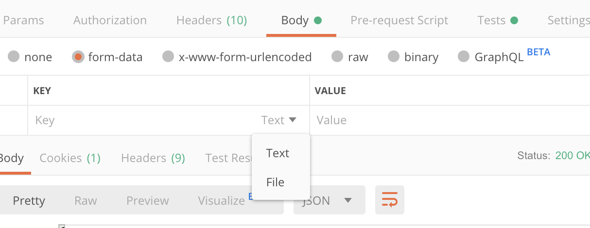
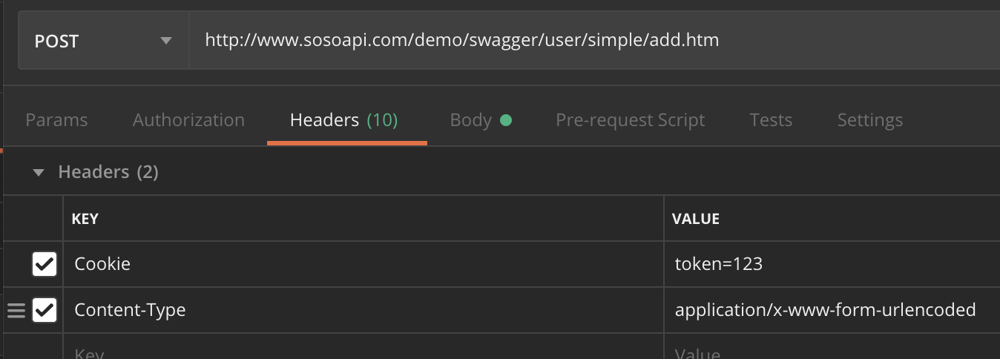
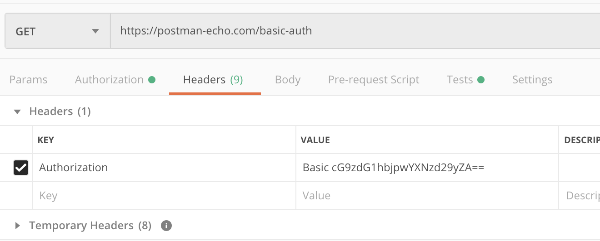

# postman发送post请求的其他场景
下面接着说说post请求的其他场景。这回我用postman官方提供的api测试网站给大家讲解。
## 发送JSON数据

如上图，发送JSON的时候，Body的格式需要选择json。
## 上传文件

当接口是一个上传文件接口，这个测试场景在postman中就需要选择form-data了。并且在key上选择File，并选择本地的文件，这样就可以测试上传文件的接口了。我暂时没有找到现成的接口，大家碰到的时候可以用这种方式。
## 设置Cookie请求头

还有一种接口是需要拿到Cookie的信息才能请求成功的。这个时候就需要在postman的请求头中设置cookie信息了，如上图所示。这种方式也比较直接。Cookie的获取也有几种方式：
1. Chrome或者Firefox浏览器的调试模式，可以拷贝cookie信息
2. Fiddler或者Charles的请求拦截中有cookie信息的显示
这两种方式都可以获取到cookie信息。只需要请求一次就可以拿到。
## 认证信息的设置
这种我不怎么用到，写出来提供给可能用到的朋友。

这是在请求头写入了Authorization字段，值是认证的信息。一般用在接口需要这种认证的场景中。
## 小结
今天跟大家详细聊了聊post请求的四种场景，一般的post请求都会组合上述几种方式，当响应错误时，需要特别注意请求头和Body的类型。很多时候就因为一个没注意设置，而耽误了很多时间。
