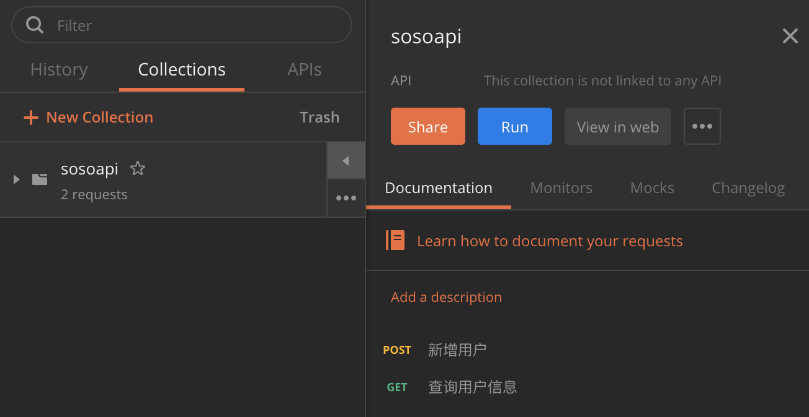
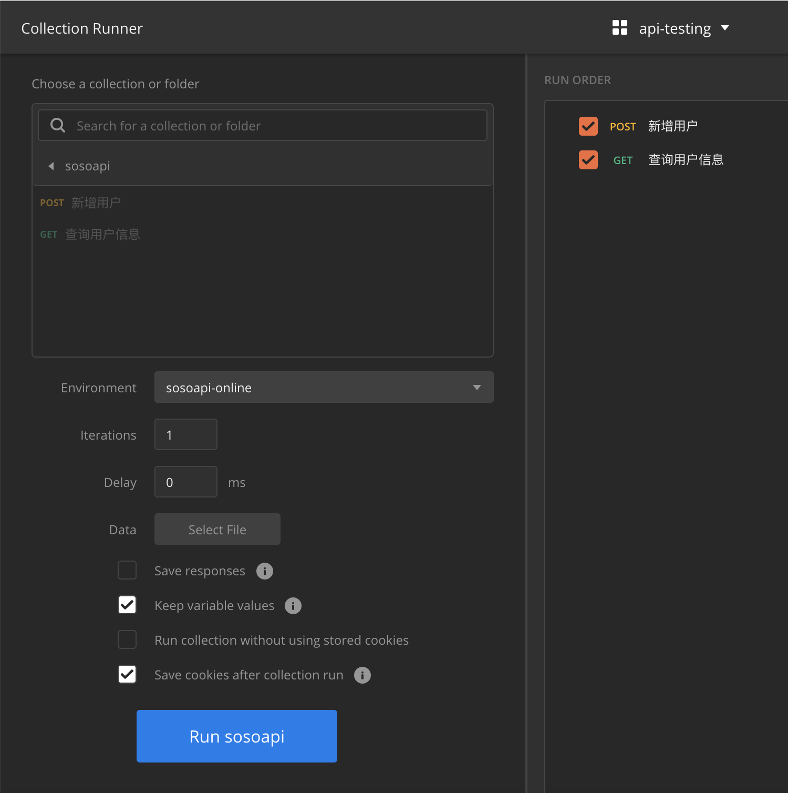
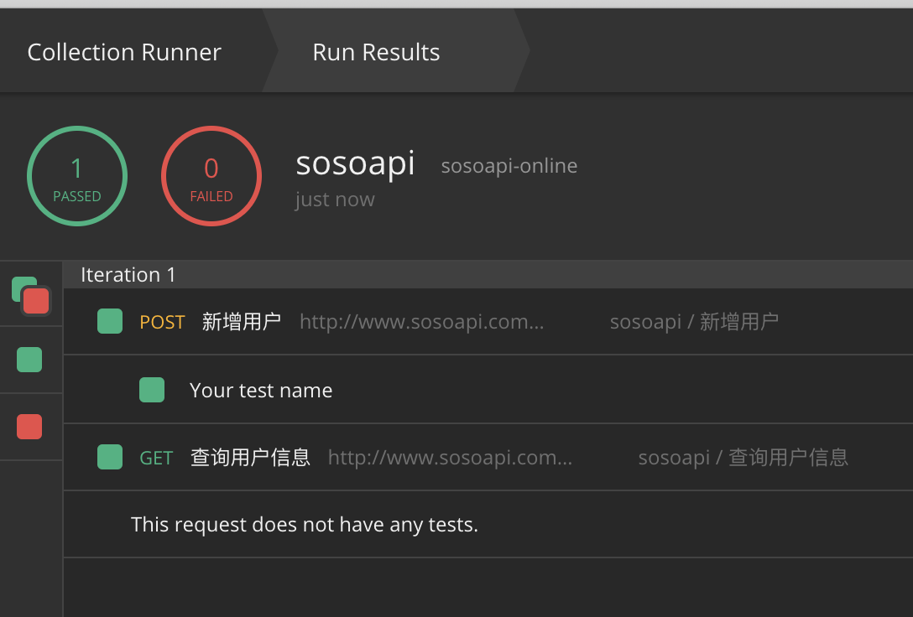
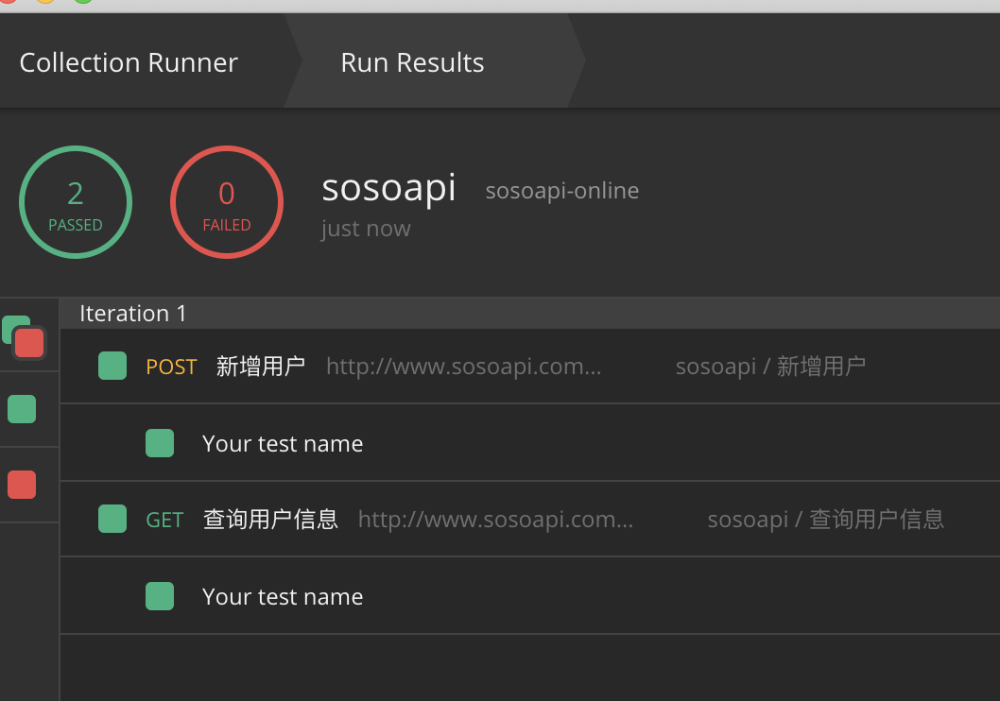
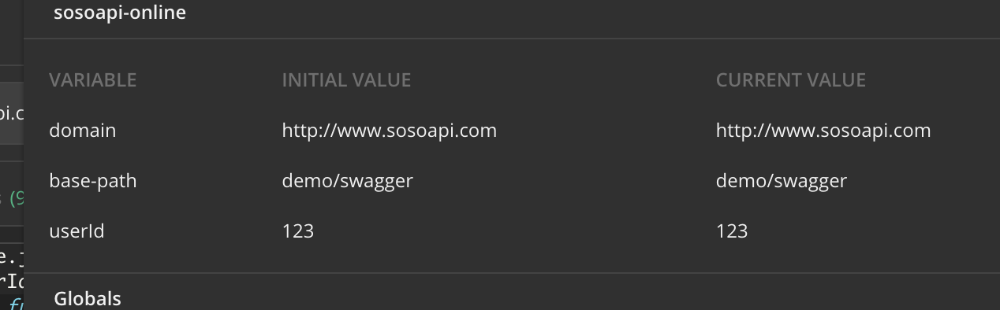
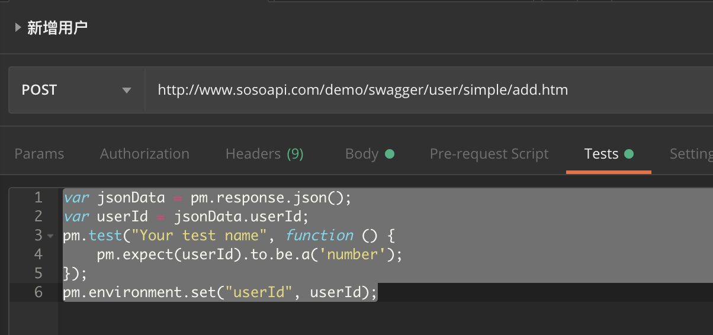

# postman运行用例集
## runner入口
postman不但提供了api用例的管理，对于执行也有自己的机制。先说下入口：

可以看到Runner就是批量执行的入口了
## 批量运行的尝试

可以看到Collection里面保存的接口用例都被选中了。如果没有做任何的参数化等动作，直接运行就可以了。运行的结果如下图所示：

可以看到运行了两条用例，一条pass了，另一条因为没有写Test，所以没有运行结果。对于怎么加Test，可以参看之前的《postman的断言》这篇文章。
好了，我们加上简单的断言再试下

可以看到这回两条用例都运行成功了。
## 带环境参数的批量运行
现在有这样的场景，我们需要先添加用户，再通过添加用户返回的id，去查询用户是否存在。这样的流程化其实就是多个接口之间的自动化测试用例。在postman里面我们需要这样做：
1. 添加环境变量

我们加上了userId这个环境变量，并且设置了一个默认值
2. 在第一个接口用例中拿到响应的用户id，并设置环境变量的值

在Tests上写上这段代码，目的就是获取到userId
```js
var jsonData = pm.response.json();
var userId = jsonData.userId;
pm.test("Your test name", function () {
    pm.expect(userId).to.be.a('number');
});
pm.environment.set("userId", userId);
```
3. 在第二个接口用例中使用用户id的值

用{{}}这种方式使用变量的值
4. 再次运行，也是可以成功的。
## 小结
本篇简单说了下如何批量运行的，以及通过Test断言结果，从而可以获得自己希望的报告。当然Runner功能还有很多，下面还会围绕Runner再跟大家聊聊。