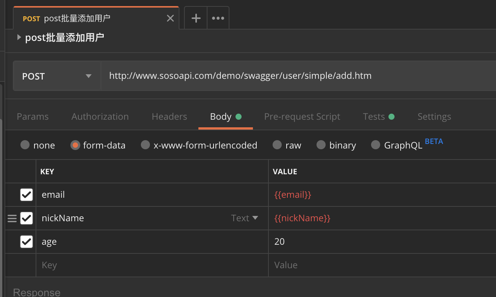
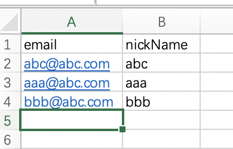
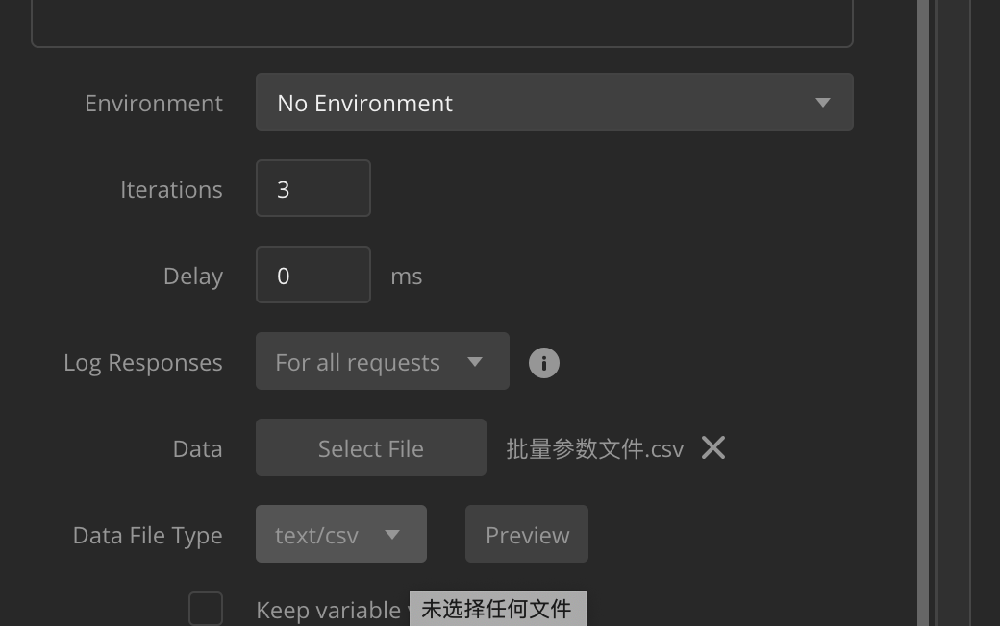
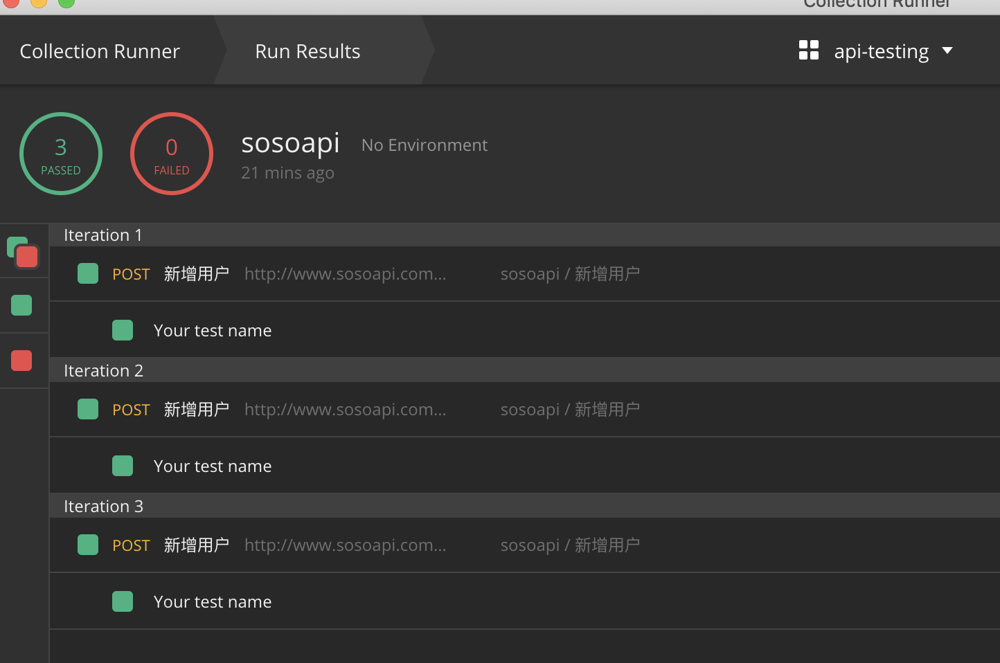
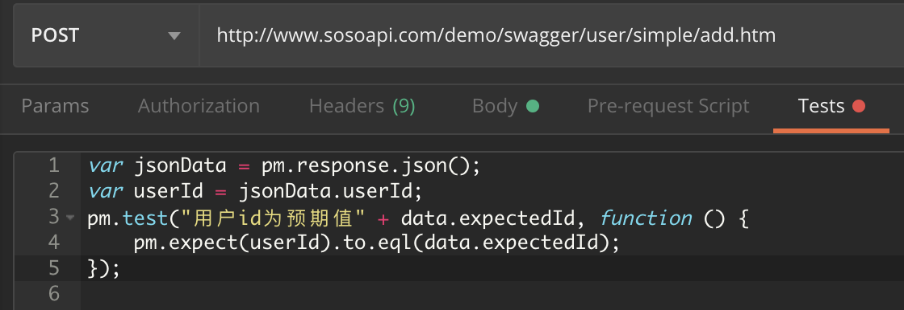
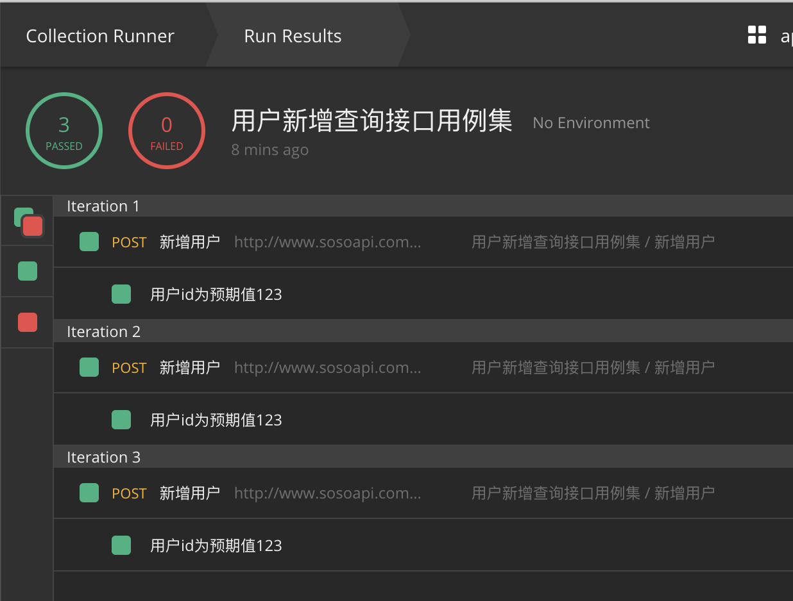

# postman之参数化运行
## 介绍
承接上文的runner批量运行，我相信我们会有这样的需求，就是我的接口用例中有些数据是变化的，可能会有成百上千的测试数据需要同一个脚本执行。这种情况postman可以支持的。答案是肯定的。下面就给大家介绍下参数化运行的简单过程。
## 接口用例的改造
既然有些数据是变化的，我们就需要把那些变化的数据用一个特殊的表达式表示，告诉postman这些数据需要你的帮助。就像我们之前说环境的表达一样，写法就像下面这样：

可以看到email和nickName设置为特殊的写法了。
## 设计一个csv文件
既然email和nickName是变化的，那变化的数据来源是不是应该我们来创建。好了，我们就按照列名和数据写一个csv文件：

我们用excel写了这样的文件，注意要保存成[csv文件](user-data.csv)。
## Runner运行
我们还是打开Runner，我们只选中刚才我们改造的批量添加用户的接口用例，然后很重要的是下面的设置：

在Data这项，我们选择保存好的csv文件，然后Data File Type会识别出来这个文件的格式是text/csv，这样就可以读取到csv中的数据了。然后我们点击运行就可以了。

可以看到Runner运行了3次，每次都是Pass的。其实就对应着我们在csv里面写的三条数据了。
## 在断言中动态获取预期值
我们在断言中也可以获取到数据文件中的值，用于跟响应值的断言。这次不用{{}}，而是用内置的data对象去获取。

```js
pm.test("用户id为预期值" + data.expectedId, function () {
    pm.expect(userId).to.eql(data.expectedId);
});
```

看看结果是不是更加明确和方便啦。
## 小结
今天跟大家说了下postman的参数化运行，是不是不用担心成千上万条数据需要准备或者修改成千上万个接口用例了。